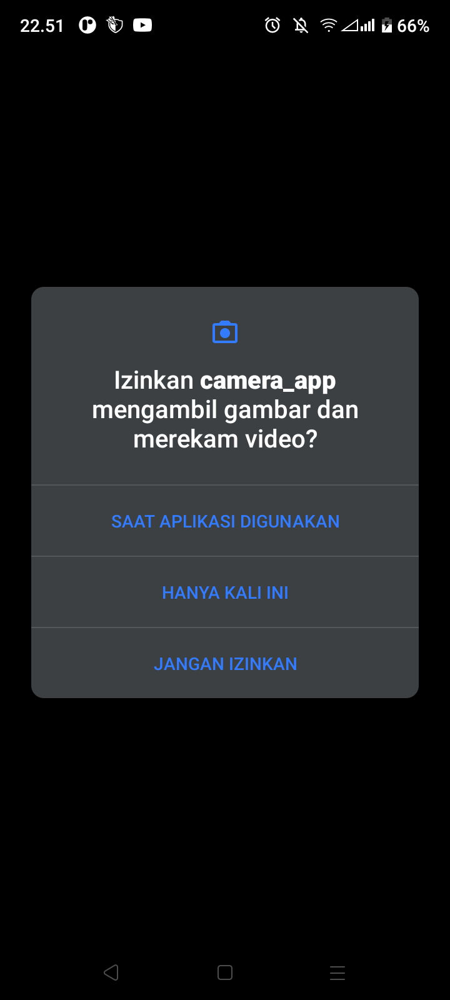

# Camera App

```
TI-3A / Kelompok 5 :

SEPTA PUMA SURYA		NIM. 2241720119
DIKA DWI ALAMSYAH 		NIM. 2241720129
ANDREAGAZY IZA AMERIANTO	NIM. 2241720146
FARID FITRIANSAH ALFARIZI	NIM. 2241720055
```

## Note
Buka file ```pubspec.yaml```, ganti versi sdk sesuai dengan versi sdk yang telah terinstal.

```
environment:
  sdk: (versi sdk)
```

## 1. Preview Photo (saat foto belum diambil)


## 2. Camera Permission



## 3. Microphone Permission


## 4. Take Photo


## 5. Preview Photo (saat foto sudah diambil)

